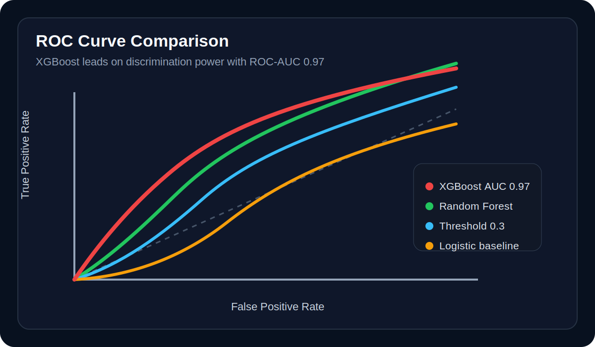
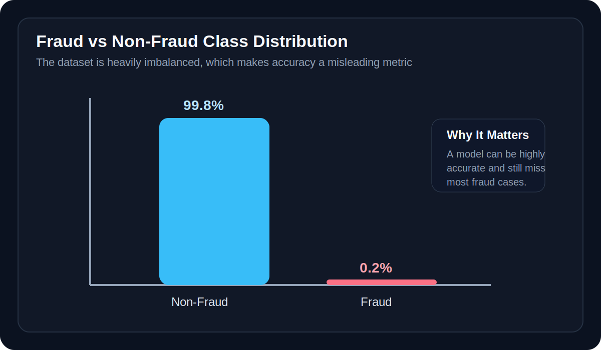
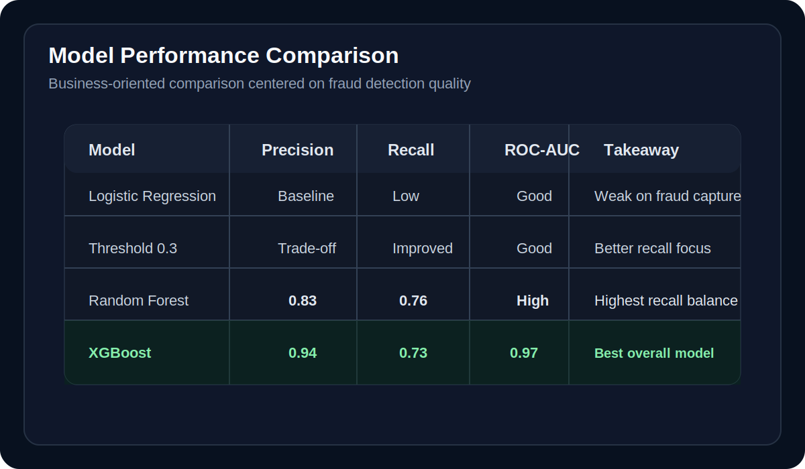

# Credit Card Fraud Detection with Machine Learning

> Detecting fraud with 99% accuracy can still be useless, this project shows why.

This project explores credit card fraud detection using machine learning in a highly imbalanced dataset, where traditional accuracy can hide poor fraud detection performance. The focus here is not only training models, but evaluating them with the metrics that actually matter in a business-critical fraud scenario.

## Business Problem

Credit card fraud detection is a real-world classification problem with a severe class imbalance. In this dataset, legitimate transactions represent about 99.8% of observations, while fraudulent transactions account for only 0.2%.

That means a model can achieve very high accuracy and still fail at the most important task: identifying fraud.

## Project Goal

Build and compare classification models to detect fraudulent transactions, prioritizing metrics such as recall, precision, F1-score, and ROC-AUC instead of relying on accuracy alone.

## Workflow

- exploratory data analysis
- class imbalance analysis
- feature engineering on transaction amount
- baseline modeling with Logistic Regression
- ensemble modeling with Random Forest and XGBoost
- threshold tuning to improve fraud recall
- SMOTE resampling for minority-class learning
- model comparison focused on fraud detection trade-offs

## Visual Preview

### ROC Curve

  

### Class Distribution

  

### Model Comparison

  

## Models Evaluated

- Logistic Regression
- Logistic Regression with threshold tuning
- Random Forest
- XGBoost
- Logistic Regression with SMOTE

## Evaluation Metrics

Because of the class imbalance, the project prioritizes:

- precision
- recall
- F1-score
- ROC-AUC

## Results

- XGBoost achieved the best overall performance.
- XGBoost reached 0.94 precision, 0.73 recall, and 0.97 ROC-AUC.
- Random Forest delivered slightly higher recall at 0.76, with strong precision at 0.83.
- Threshold tuning significantly improved fraud detection recall.
- SMOTE helped the model learn minority class patterns more effectively.
- Accuracy alone proved to be misleading due to severe class imbalance.

## Key Insight

In fraud detection, missing a fraudulent transaction is usually more costly than investigating a false positive. This project shows why model evaluation must be aligned with business impact, not just headline accuracy.

## Tech Stack

- Python
- Pandas
- NumPy
- Scikit-learn
- XGBoost
- imbalanced-learn
- Matplotlib
- Jupyter Notebook

## Dataset

The dataset contains anonymized credit card transactions with:

- `Time`
- `Amount`
- `V1` to `V28` PCA-transformed features
- `Class` where `0 = non-fraud` and `1 = fraud`

Dataset source:

- https://www.kaggle.com/datasets/mlg-ulb/creditcardfraud

## Main Learnings

- accuracy is not reliable for imbalanced classification problems
- recall becomes critical when the cost of missing fraud is high
- threshold tuning can materially improve fraud detection
- SMOTE is useful, but must be evaluated against the precision trade-off
- business context should guide model selection

## Repository Content

- `credit_card_fraud_detection_ml.ipynb`: full notebook with EDA, modeling, evaluation, and analysis
- `requirements.txt`: project dependencies

## Author

Diego Pablo

- [GitHub](https://github.com/DiegoPablo2021)
- [LinkedIn](https://www.linkedin.com/in/diego-pablo/)
- [Portfolio](https://diego-pablo.vercel.app/)
